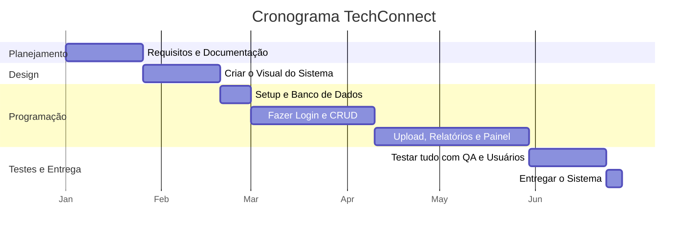
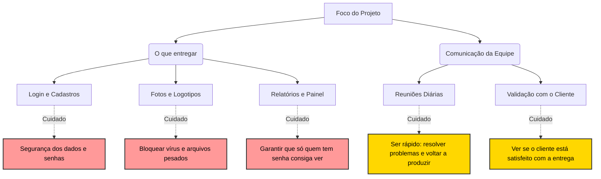

# atividade-crystal
Cronograma e Matriz Crystal

Gráfico de Gantt (Cronograma)

```mermaid

   gantt
    title Cronograma TechConnect
    dateFormat  YYYY-MM-DD
    axisFormat  %b

    section Planejamento
    Requisitos e Documentação :a1, 2024-01-01, 25d

    section Design
    Criar o Visual do Sistema :b1, after a1, 25d

    section Programação
    Setup e Banco de Dados :c1, after b1, 10d
    Fazer Login e CRUD :c2, after c1, 40d
    Upload, Relatórios e Painel :c3, after c2, 50d

    section Testes e Entrega
    Testar tudo com QA e Usuários :d1, after c3, 25d
    Entregar o Sistema :e1, after d1, 5d

```

Matriz de Atenção Crystal Clear

```mermaid

   flowchart TD
    A[Foco do Projeto] --> B(O que entregar)
    A --> C(Comunicação da Equipe)

    B --> D[Login e Cadastros]
    D -. Cuidado .-> D1[Segurança dos dados e senhas]

    B --> E[Fotos e Logotipos]
    E -. Cuidado .-> E1[Bloquear vírus e arquivos pesados]

    B --> F[Relatórios e Painel]
    F -. Cuidado .-> F1[Garantir que só quem tem senha consiga ver]

    C --> G[Reuniões Diárias]
    G -. Cuidado .-> G1[Ser rápido: resolver problemas e voltar a produzir]

    C --> H[Validação com o Cliente]
    H -. Cuidado .-> H1[Ver se o cliente está satisfeito com a entrega]
    
    %% AJUSTE DE CORES E LEGIBILIDADE
    style D1 fill:#FF9999,stroke:#333,stroke-width:2px,color:#000
    style E1 fill:#FF9999,stroke:#333,stroke-width:2px,color:#000
    style F1 fill:#FF9999,stroke:#333,stroke-width:2px,color:#000
    style G1 fill:#FFD700,stroke:#333,stroke-width:2px,color:#000
    style H1 fill:#FFD700,stroke:#333,stroke-width:2px,color:#000

```
